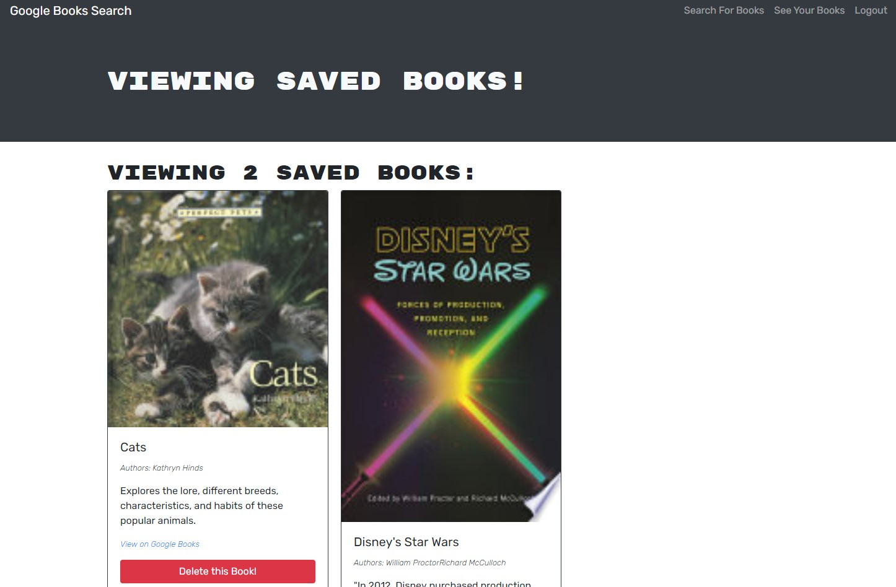

# GraphQL Book Search
A refactored version of a book search engine using GraphQL instead of a RESTful API

## Description
This is a simple book search website with options to add/remove books on a saved list after signing up and logging in.

It originally functioned using a REST API structure but was refactored to use GraphQL for database interactions.

Prior to sign-up/login the site allows users to serach for books through the Google Books API and then the returned books matching the search term are visible with the only interaction being the ability to clink the provided link to the book on the Google Books website.

After sign-up/login searched books have an added button which allows them to be added to a "Saved Books" list. All of a users saved books can be viewed by clicking the "See Your Books" link at the top right of the page.

On the users saved books page all of the users saved books are displayed and have an added button to remove them from the list.

## Table of Contents
* [Installation](#Installation)
* [Usage](#Usage)
* [Technologies](#Technologies)
* [Preview](#Preview)

## Installation
No installation is necessary as the app is deployed to Heroku. However as noted in the description after visiting the site it can be installed as a standalone app.

## Usage
App is on Heroku at https://serene-temple-19244.herokuapp.com/

## Technologies
This application was made using

## Preview

### Screenshots

